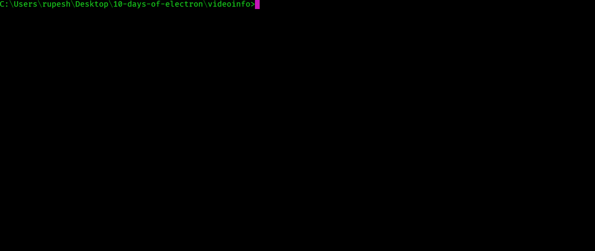
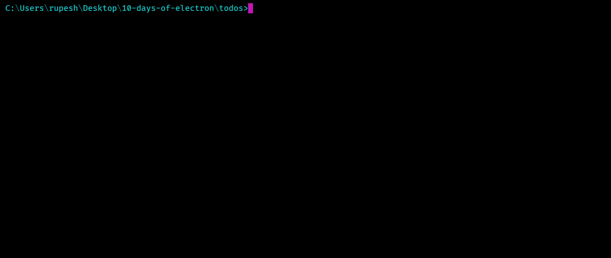
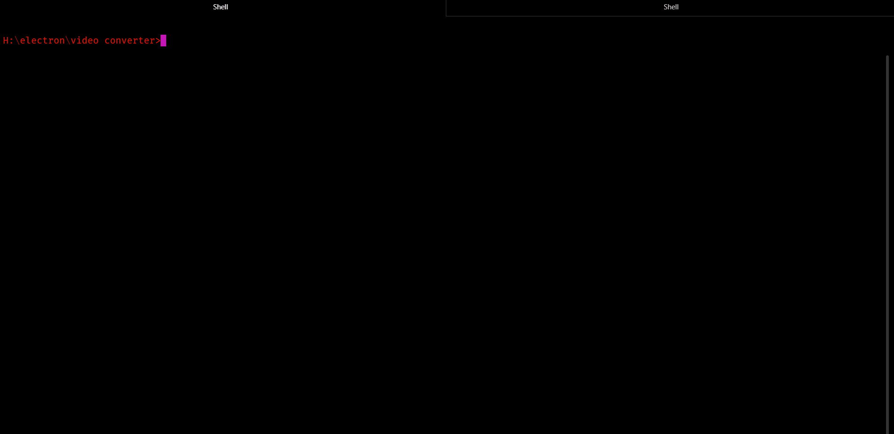

# 10 days of electron

  


## How To Use

To clone and run this application, you'll need [Git](https://git-scm.com) and [Node.js](https://nodejs.org/en/download/) (which comes with [npm](http://npmjs.com)) installed on your computer. From your command line:

```bash
# Clone this repository
$ git clone git@github.com:rupesh1310/10-days-of-electron.git

# Go into the repository
$ cd filename

# Install dependencies
$ npm install

# Run the app
$ electron .
```

  

[**Video Info:**](https://github.com/rupesh1310/10-days-of-electron/tree/master/videoinfo) Familiarizing with basics of Electron app development, analyzing video files using the FFMPEG CLI




  

 [**todos:**](https://github.com/rupesh1310/10-days-of-electron/tree/master/todos) Manipulating multiple windows with Electron, customizing menu bars, and developing with an emphasis on cross-platform experience


  

 [**VideoConverter:**](https://github.com/rupesh1310/video-file-converter)Integrating Electron with React and Redux to convert video files.

